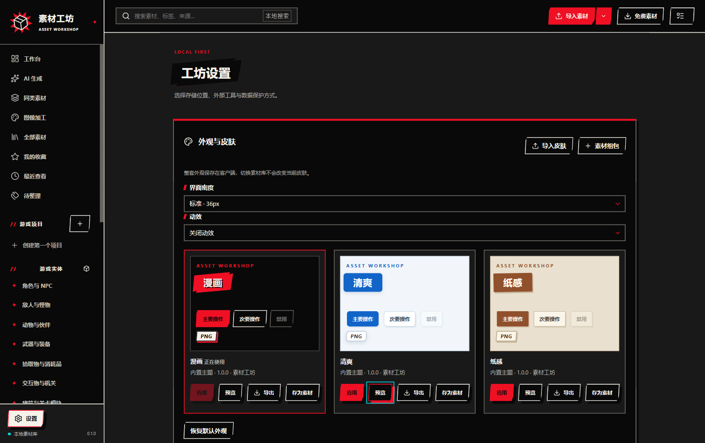

# OmO · 素材工坊

[中文](README.md) · [MIT License](LICENSE) · [Contributing](CONTRIBUTING.md)

**OmO** is a local desktop asset workshop for game development. Manage images, atlases, 3D models, PBR materials and UI skins in one library, keeping originals, versions, provenance and licenses. Preview, organize, process and export assets to Godot or standard ZIP packages.



- Local search, projects, collections, tags, asset groups, trash and consistent backups.
- Image channels, pixel grids, atlases, nine-slice controls and frame sequences; GLB/glTF, OBJ/MTL, FBX and animation previews.
- PBR variants, side-by-side comparisons and dependency-aware Godot exports.
- Local image processing and optional Codex, OpenAI-compatible Images API and RunningHub integrations.
- Three global skins: comic, fresh and paper. Assemble local images or atlas regions into versioned `.awskin` packages.
- Reusable React controls, original SVG decorations, motion presets and offline component demos.

Local browsing, previews, processing and exports work offline. Asset downloads and cloud AI are optional network features; no AI account is required to use the library.

## Development

Use Node.js 24.19.0 or newer and pnpm 11.25.0.

```sh
git clone https://github.com/alexxxiong/OmO.git
cd OmO
pnpm install --frozen-lockfile
pnpm dev
pnpm build
pnpm test
pnpm test:e2e
pnpm package
```

Windows x64 has been verified locally. macOS and Linux build configurations are included and require testing on their target platforms. On headless Linux, use `xvfb-run --auto-servernum pnpm test:e2e`. Distribution packages are currently unsigned.

The repository contains source, documentation, original UI artwork, sample skin packages and licensed test fixtures. Personal libraries, credentials, generated application packages and generated sample deliveries are excluded. Run `pnpm samples` and `pnpm demos` to generate the Godot examples, `pnpm ui:export` for the UI bundle, or `pnpm skins:export` for skin assets.

See the [Chinese documentation](README.md#文档) for the full workflows and protocol. Application source and original UI artwork use MIT; third-party code and sample assets retain their own licenses and provenance.
