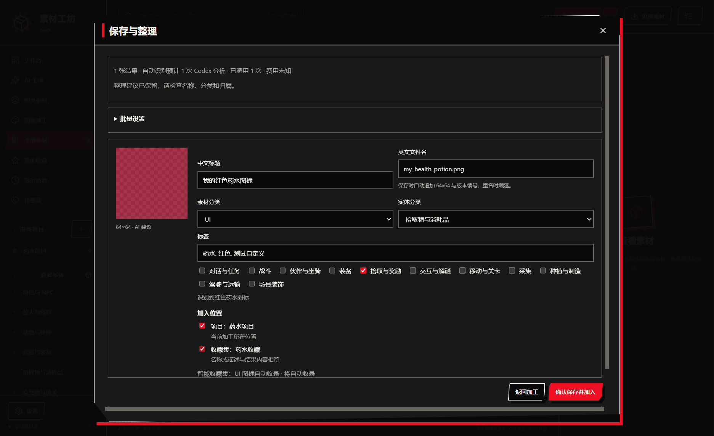

# 加工结果保存与整理

双击工作区的 `启动示例工坊.cmd`，使用 `release/family-client/win-unpacked/素材工坊.exe`。已有程序运行时，先关闭再打开新版。

## 保存流程

1. 加工完成后，每张输入的最终结果默认选中；也可手动勾选中间步骤。
2. 点击「保存与整理」。本地建议立即出现，已启用的 Codex 连接自动识别图片。制作助手使用的 Codex 连接优先，否则使用第一个已启用的 Codex 连接。
3. 检查缩略图、中文标题、英文文件名、素材分类、实体类别、玩法标签、标签和推荐位置。「批量设置」可统一标题前缀、分类、追加标签和加入位置。
4. 勾选项目或手动收藏集，点击「确认保存并加入」。可以只入库；不会自动创建项目或收藏集。
5. 完成后点击「查看入库素材」「打开项目」或「打开收藏集」。衍生素材可继续加工、加入项目和通过现有导出流程交付。

## 命名与分类

中文标题用于素材库显示，英文文件名用于导出和交付。英文主体仅允许小写字母、数字和下划线，可省略 `.png`。后台按实际输出尺寸添加规格和版本，例如 `health_potion_red_64x64_v01.png`。确认时预留名称；同名顺延至 `v02` 等，失败重试沿用原编号。内部加工历史路径保持稳定，原件不会被改名。

已有来源分类优先保留。AI 建议改变分类时显示理由，可点击「采用 AI 分类」。不确定的内容标记待确认。尺寸和透明标签通过完整图片的实际像素检查生成。识别期间的手动修改不会被迟到的 AI 建议覆盖；关闭面板保留有效整理草稿。

## 推荐位置

项目和手动收藏集各最多推荐三个，按当前加工上下文、来源归属、已有分类和标签相似度、名称及描述匹配排序，每条显示理由。明确的当前项目或手动收藏集默认选中，其余推荐需要勾选。点击「选择其他位置」可选择库内其他真实位置。

智能收藏集通过与素材查询相同的规则判断，显示「将自动收录」；它们无需手动加入。元数据或项目选择变化后重新匹配。目标被删除或改为智能规则时，保存前提示取消该目标，不会引用失效位置。

已保存的素材可以继续补充项目和手动收藏集。此入口不解除已经完成的关联；解除归属使用素材库现有项目／收藏集操作。

## 自动识别、失败与恢复

每批最多五张，每批一个结构化 Codex 分析回合。面板显示预计和实际调用次数，费用显示未知。全局执行并发仍为二，Codex 分析与生成合计最多一个。连接不可用、分析失败或取消时，本地建议继续可用，可以直接保存；不会自动切换服务。

识别缓存包含图片哈希、来源、需求、模型和规则版本。同一草稿重开不会重复调用；重启后的未完成识别标记中断，不自动重放。已开始的识别不能通过任务重试再次收费调用。可停止识别，保留已完成建议和手动草稿。

名称、导入结果、项目及收藏集关联分别记录进度。重复点击复用已完成的导入；批量部分失败保留成功项，重试补齐失败步骤。已提交的名称和分类冻结，修改需求通过素材库整理操作处理。正在识别或入库的结果受到删除保护。

完整备份、恢复和数据库重建保留草稿、缓存、命名记录及库内关联。标准素材包保留名称、分类和加工来源；跨库导入不套用原库项目或收藏集 ID，后续加工重新推荐新库位置。应用连接与密钥不会进入这些文件。

## 验证

真实 Codex 已完成一次图片识别、命名分类和项目入库，结果见 实测记录（本地生成文件：processing-organize-codex-qa.json）。桌面测试另通过可控模拟连接验证迟到的 AI 结果、手动修改、智能收藏集、重复入库和导航。整体结果见 [验证清单](processing-organize-validation.json)。
