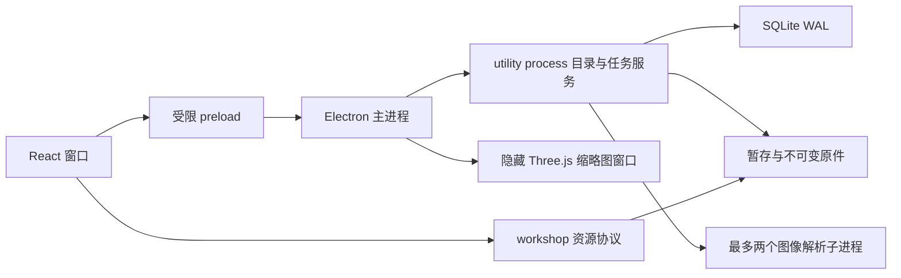

# 素材工坊技术实现说明

本说明描述当前源码的模块、持久化约定、资源接口与构建方式。客户端使用 Electron 44.5.1、React 19.3.0、TypeScript 7.0.2、Three.js 0.186.1，版本由 `package.json` 和 `pnpm-lock.yaml` 固定。

## 进程与模块

右键和「更多操作」共用 `ContextMenu.tsx` 的命令调用与 Portal 菜单。`WorkshopMenus.tsx` 捕获稳定对象 ID，`WorkshopActions.tsx` 承接批量整理、关联、贴图匹配和检查面板；查看器菜单直接调用本地相机／图像能力。菜单不订阅目录 epoch，缩略图就绪只更新对应卡片。

`core/commands.ts` 提供 `assets.selection`、`assets.organize`、收藏集与变体管理、所选缩略图重建和 `exports.quick`。批量修改在一个事务中提交，再写一次快照与目录事件；内置 SQLite 驱动通过 SAVEPOINT 支持嵌套事务。快捷导出按项目 ID 读取持久工程绑定，先在暂存区生成并检查实际文件冲突，再启动导出；写入前重复冲突检查。

辅助图片使用 `metadata.auxiliaryRole = "preview"`，默认过滤与素材统计排除，`includeAuxiliary` 可显示。缓存缩略图不插入素材表。标记包含于组织快照、数据库备份和标准 ZIP 元数据；Godot 排除独立辅助入口但保留资源依赖，通用包加入同版本包内的辅助记录。



`src/main/index.ts` 管理窗口、系统文件选择授权、IPC、目录切换、资源协议、缩略图队列和服务重启。`src/preload/index.ts` 只暴露 typed bridge；renderer 没有 Node 集成，启用 sandbox 与 context isolation。

`src/main/service.ts` 启动 `Runtime`。目录查询、任务状态、导入、下载、导出、备份均在界面线程之外执行。`MediaPool` 使用最多两个独立 Node 子进程，40 秒超时，512 MB JS heap；Sharp 设置两个原生处理线程和 64 MB 缓存。操作系统级总内存/CPU 硬上限尚未配置，JS heap 不能代替原生内存总限额。

`src/core/catalog.ts` 管理 SQLite 表、FTS5、关系与元数据快照；`importer.ts` 实现暂存复制、检查点、内容哈希和提交；`media.ts` 处理格式和依赖；`sources.ts` 实现免费来源解析、下载与校验；`exporter.ts` 实现 glTF 变体和 Godot/ZIP 输出；`recovery.ts` 依据清单重建新库。

当前同时执行最多两个后台任务。解析线程池独立限制为两个，三维缩略图串行，Blender 转换通常按单个用户请求运行。任务调度尚未形成按类型独立的完整优先级与内存预算调度器。

## 素材库布局

实体分类与玩法标签分别保存在 `metadata.entityCategory`、`metadata.gameplayTags`，不替代原 `category`。首次打开旧库时通过 `workshop_migrations` 中的 `entities-v1` 标记执行增量分类，保留已有显式设置。`assets.query` 和智能收藏查询支持 `entityCategory`、`gameplayTag`。

`assets.groups({query,mode})` 返回分页聚合组，`mode` 为 `entity` 或 `package`；每组包含代表素材、完整成员 ID、组成统计、聚合依据和缺失依赖数。`assets.groupSelection` 返回当前筛选全部组的去重成员。实体组限定同版本，按规范化文件名及控件状态关系聚合，再追加依赖闭包；共享依赖可属于多组，不用于合并实体。`assets.organize` 的 `group:{name}` 为所选成员创建显式组，`group:null` 恢复自动聚合。组信息位于 `metadata.assetGroup`，新版本和标准包再导入重映射组 ID，避免与原库组混合。

`exports.inspect` 接受 `aggregate:true`，同一版本成员共用一个输出目录，文件清单去重。Godot 聚合交付默认优先同一版本、相同对象名称的 GLB/glTF，可用 `preferGLTF:false` 交付所有模型格式；不同命名的动画文件保留，已选择材质变体的模型不会被替换。仍使用原有依赖检查、哈希校验、许可证交付及覆盖冲突保护。分类、玩法标签与手动组随标准素材包和备份保存。

```text
Library/
  library.json
  catalog.sqlite
  packages/{packageId}/{revisionId}/
    source/                  原件相对目录
    manifest.json            文件、哈希、依赖与入口
    licenses/                来源证据与包许可
  variants/                  材质变体与转换副本
  metadata/catalog.json      项目、标签、变体与组织快照
  cache/                     可重建预览和缩略图
  staging/                   任务暂存与复制检查点
  trash/                     预留目录；当前逻辑删除在数据库保存
  exports/                   默认输出目录
  .write.lock                当前写入进程 PID
```

缓存键由内容哈希、预览类型和版本构成。访问更新 mtime，容量超过配置时按 mtime 淘汰；选中非原生图片时可重新生成丢失的详细预览。模型静止时按需渲染，播放动画时运行帧循环。关闭查看器释放几何、材质、纹理、ImageBitmap、环境与解码器；显示模式和变体替换时单独释放派生对象。

SQLite 对象包括 revisions、assets、projects、project_assets、collections、collection_assets、variants、provenance、jobs、exports 及 FTS 虚拟表。文件与依赖保存在 revision manifest JSON，标签是素材字段中的 JSON 数组。

逻辑素材 ID 保存在 `metadata.logicalId`，每个版本的素材记录有独立稳定 ID；项目关联固定该记录与 revision。原始版本的 ID 同时作为默认逻辑 ID。导入新版本根据相对路径匹配，项目升级明确更新固定关系。

包去重按所有相对路径与 SHA-256 计算清单哈希。单文件相同内容可在解析缓存层复用，但没有改变包内目录进行物理文件级去重。项目关系不会复制原件。

## IPC 与资源访问

IPC 请求由原生文件选择或真实拖入授权外部目录；校验调用窗口、main frame、URL 与参数。库对象使用 ID。查询、变体、配置及多数写接口通过 Zod 校验，SQL 使用参数绑定。

主要接口为 `assets.query/detail/update/tags/versions`、`imports.inspect/start`、`projects.save/attach/detach/upgrade`、`collections.save/attach`、`materials.save/list`、`sources.samples/search/resolve`、`downloads.start`、`exports.inspect/start`、`jobs.control`、`backups.create/restore/rebuild`。完整可调用方法与错误分支以 `Runtime.handle` 为准。

资源地址为 `workshop://assets/{packageId}/{revisionId}/source/{relativePath}` 与 `workshop://cache/{hash}-image-v1.webp`。主进程确认文件列入清单并执行路径约束；SVG 原文不直接返回。模型 URL modifier 禁止 http、https、file 与 FTP 依赖，包内 `../textures/` 引用允许规范化到受控包根内。

ZIP 在展开前后检查容量、条目路径、加密、符号链接与大小写冲突。文件名同时遵守 Windows 保留名与非法字符约束。Blender 使用固定 Python 脚本、参数数组、`--factory-startup --disable-autoexec` 与超时，无 shell 拼接。

## 标准素材包 v1

导出的 ZIP 根包含 `workshop-manifest.json`，另有相同信息的 `workshop-export.json` 和 README。清单使用 UTF-8 JSON：

```json
{
  "schemaVersion": 1,
  "exportId": "uuid",
  "createdAt": "ISO8601",
  "mode": "generic",
  "assets": [
    {
      "id": "stable-asset-id",
      "revisionId": "revision-id",
      "path": "asset-folder/revision/source.png",
      "title": "素材标题",
      "category": "ui",
      "tags": ["按钮", "button"],
      "metadata": {
        "nineSlice": { "top": 4, "right": 4, "bottom": 4, "left": 4 }
      },
      "dependencies": [],
      "relatedPaths": []
    }
  ],
  "files": [
    {
      "path": "asset-folder/revision/source.png",
      "sha256": "实际64位哈希",
      "bytes": 1024
    }
  ],
  "variants": [],
  "entries": []
}
```

以上哈希和大小为结构示意，导入时必须符合真实内容。素材 ID 冲突时生成映射，重写状态组与变体贴图引用，返回 `idMapping`。导出文件清单中的哈希全部检查；实际文件和自动解析的依赖是物理路径依据。材质变体参数在提交前通过同一 Zod schema 校验。

## 备份与恢复

备份先调用 SQLite backup，读取快照中的版本、变体和关系，再复制该快照引用的不可变目录。源文件与清单哈希不一致时失败。备份清单列出文件哈希，恢复先验证再复制到空目录。缓存、GPU 状态与旧机器任务运行状态不重放；外部工程和工具路径重新配置。

重建命令直接读取包内 manifest 与元数据快照，不要求原数据库能打开。它创建新库，不替换损坏库。若快照缺失，可以恢复文件入口与基础分类，项目、标签和变体组织不能保证恢复。最近快照之后尚未持久化的组织编辑也无法凭原件推断。

## 构建和验证入口

`electron-vite` 生成 main、service、media-worker、recover、preload 与 renderer。主进程模块显式 externalize Electron 和原生依赖，避免将 native package 错误打入 bundle。better-sqlite3 不可用时切换 Node SQLite；Sharp 原生 `.node` 从 asar unpack 后加载。

`pnpm dist` 由当前平台构建安装包；Windows NSIS、macOS DMG/ZIP、Linux AppImage/DEB 已配置。CI 在对应平台安装依赖，macOS 需要同时获取 x64/arm64 Sharp optional packages。CI 配置当前尚未远程运行。

`scripts/run-service.mjs` 提供 seed、stats、import、demos、source-check、backup-check；`scripts/rebuild.mjs` 启动脱离 renderer 的恢复工具。`scripts/download-godot.mjs` 获取指定官方测试版本，`verify-godot.mjs` 执行导入、加载和启动检查。所有数据工具默认写入 `.data/`，不将示例与备份嵌入客户端安装包。

## 云端图片生成

`shared/generation.ts` 定义连接、能力、请求、方案、候选、参考图与来源类型。`core/generation-adapters.ts` 提供 Codex、Images API 和 RunningHub 适配器；`core/generation.ts` 负责校验、方案、逐项调度、恢复、候选文件及入库。`GenerationPage`、`GenerationProviders` 和 `GenerationMask` 提供完整创作界面。

连接文件位于应用 userData 的 `generation-providers.json`，只有主进程 `GenerationProviderStore` 能保存和解密 `safeStorage` 密文。IPC 返回 `hasKey`，不返回密钥；后台只持有内存中的授权配置。改变服务地址不会保留旧密钥，历史重试也拒绝把新服务的密钥发往记录中的旧地址。正在使用的连接不能修改。生成记录不包含账户密钥。

素材库新增 `generation_runs`、`generation_candidates`、`generation_inputs` 和 `generation_templates` 表，原图与输入文件存入 `generations/`。主进程仅通过 `workshop://generations/candidate/<ID>` 与 `input/<ID>` 提供图片；renderer 不能调用内部路径解析方法，外部参考图和工作流导入必须经过系统选择授权。

生成请求先快照，再跨提交边界。状态包括 prepared、submitting、submitted、retrieved、completed、failed、uncertain 和 cancelled；后台 Job 增加 interrupted（需检查）与取消能力信息。远端 ID 和结果 URL 收到后立即写入 SQLite 与任务 JSON。重启仅查询已提交任务、下载已取得结果或继续尚未提交项目，未知提交禁止自动重发。候选采用确定性 ID，启动恢复补齐已提交候选的记录关联。失败项目由用户重试，已完成项目保留。恢复扫描不受最近任务列表的显示条数限制。

使用原有全局 2 个后台槽位；包含 Codex 的批次及制作助手最多占用一个 Codex 槽位。助手禁用生成和 shell 工具，并通过 `--output-schema` 返回可检查方案。Codex 直接生成使用独立目录，仅回收真实 `result.png`；候选通过 Sharp 完整解码、格式、字节和像素上限检查。

`generation.providers.*` 管理连接和工作流，`generation.assistant.plan` 返回后台方案任务，`generation.preview/start/list/detail/accept/delete` 管理候选流程，`generation.inputs.*` 与 `generation.mask.save` 管理输入，`generation.templates.*` 管理风格预设。任务控制继续走 `jobs.control`；未知提交的重试要求 `confirmUnknown`。

入库复用 `inspectImport/runImport`，持久化 `metadata.generation` 中的模型、工作流、提示词、参数、输入哈希和修改来源。候选入库任务先认领再执行，重试与重复点击不会重复导入。完整备份复制并校验生成文件及四张表，清单重建也恢复这些文件；标准素材包保留生成来源，但不携带账户配置。

`pnpm package:generation` 构建独立 Windows 目录。`tests/generation.test.ts` 验证适配器和数据恢复，`tests/e2e/generation.spec.ts` 验证实际 Electron 交互。可选 `node scripts/qa-generation-codex.mjs` 使用当前 Codex 登录执行真实助手、生图和入库，会消耗当前账户额度。具体验证结果与尚需真实账户联调的部分见 [AI 生成操作说明](AI生成操作说明.md)。

## 图像加工与 Agent Harness

`shared/processing.ts` 定义 `ImageOperation`、`ProcessingRecipe`、`ProcessingPlan`、`ProcessingArtifact`、`AgentSession` 及统一 ID 引用。`processing-tools.ts` 注册检查、预览、执行、AI 编辑与比较工具，使用完整输入及同一参数校验。Sharp/libvips 逐步输出 PNG；React Image Crop 只处理交互选区。EXIF 归一化后记录实际工作尺寸，透明边缘通过 alpha 边界计算，调色保持 alpha 字节不变。蒙版绑定完整工作图哈希，云端局部结果按 alpha 在本地合成，保留区 RGBA 精确保留。

`ProcessingService` 持久化 `processing_inputs`、`processing_runs`、`processing_artifacts`、`processing_recipes`、`agent_sessions` 五张表；图片存入 `processing/`，通过 `workshop://processing/input/<ID>`／`artifact/<ID>` 展示，renderer 不得解析真实路径。配方预览禁止 AI 调用，方案一次性消费，连接配置改变后须重新检查。每步保存输入／输出哈希、参数、工具版本、父结果与生成来源。入库先认领候选，并继承来源及许可；标准包保留 `metadata.processing`，备份和清单重建复制五张表及引用的图片。

父任务在独立协调集合中执行，基础步骤、生成、检查和入库子任务共用原有两槽调度；所有 Codex 任务共享单槽。持久化步骤游标、子任务及生成运行 ID，恢复时查询已有远端任务或继续下载；未知提交进入 interrupted。助手回合在请求前持久化分析计数，中断回合不自动重发。恢复备份和重建不重放旧机器任务，未完成加工与会话标记为需检查／待调整。

`CodexProcessingHarness` 使用 App Server stdio 的 initialize、thread/start/resume、turn/start 和结构化输出，同一 session 保存 thread ID、历史及回合计数；禁用 shell、生成、外部工具和其他副作用能力，工坊负责执行经过校验的行动。初始化协议不兼容时调用既有 `codex exec --json`，同一服务及上下文保持不变；发出 turn/start 后不自动回退重推理。方案先由用户启动，结果送回助手检查，最多八个分析回合及一次额外修正，增加步骤／服务或超预算停止并保留候选。

IPC 包含 `processing.capabilities/inputs/preview/previewImage/start/list/detail/accept/delete`、`processing.recipes.*`、`processing.mask.save`、`processing.assistant.plan/continue`，任务控制仍使用 `jobs.control`。RunningHub 连接的 `purposes` 标记 edit／recolor／removeBackground／restore／upscale；专用工具检查用途及图片映射，沿用已有上传、提交快照、远端 ID、查询、下载、取消机制。

运行 `pnpm package:processing` 构建独立版本。`tests/processing.test.ts` 覆盖完整像素、蒙版、调用限制、并发、恢复与来源；`tests/e2e/processing.spec.ts` 覆盖生成 → 裁剪 → 蒙版编辑 → 比较 → 衍生入库 → 项目导出 → 历史继续。可选 `node scripts/qa-processing-codex.mjs` 使用已有 Codex 登录测试实际方案和视觉检查，会消耗分析额度。操作与验收见 [图像加工说明](图像加工操作说明.md)。

## FBX 预览兼容处理

`WorkshopFBXLoader` 在加载器 `parse` 入口处理 ASCII FBX 的文本格式兼容，展开预览、侧栏、独立动画片段及三维缩略图共用这一入口。规整依赖字符串和注释以外的括号结构，不依赖导出器的空白缩进；只移除完整数值数组末尾的分隔逗号，保留数组内部的逗号和所有数值。换行数组的续行置于加载器要求的起始列。字符串中的路径、括号和分号保留。括号不完整或嵌套过深会明确报错；二进制 FBX 不解码、不改写。库内原件和清单哈希不变。

FBX 缩略图失败记录带解析器版本。新版本可以重试旧失败；当前解析器仍失败则停止自动重试，手动重建继续可用。成功清除失败标记并发送局部 `thumbnail.ready`，不触发整库刷新。

## 加工结果保存与整理

`ProcessingOrganizeService` 负责本地检查、Codex 命名分类、草稿和缓存、真实目标推荐以及衍生入库。共享协议增加 `ProcessingSaveProposal`、`ProcessingDestinationRecommendation`、`ProcessingAcceptItem` 和保存进度记录。IPC 提供 `processing.organize.preview/start/detail/update`；`processing.accept` 接受逐项元数据和多个目标，并兼容原 `artifactIds/projectId` 调用。

库内 JSON 表 `processing_save_proposals` 保存建议、字段修改和分析回合，`processing_organize_cache` 保存按图片／来源／需求／模型／规则版本计算的缓存，`processing_save_items` 保存冻结的提交信息、名称和逐个目标的完成进度。文件名的 JSON 字段有唯一索引。确认时在同步事务中分配编号，执行前记录素材任务占用，避免重复点击和并发命名冲突。库快照写入串行化，避免 Windows 同时替换文件导致失败。

`processing-organize` 使用现有任务调度和 Harness，每五张结果最多一个结构化回合。发送前记录 batch 状态和会话；已开始的回合中断后保留建议，不自动重复。人工修改字段单独存储，应用 AI 结果时合并；已提交项以冻结记录为准。首次检查及缓存命中不调用生成接口。

入库复用现有导入器，从受控加工 ID 解析完整原件，校验 SHA-256，再写入 `processing/accepted/<artifactId>/<friendlyFilename>` 和托管素材目录。导入提交后立即记录素材 ID，然后分别记录项目、收藏集关联。若重启发生于导入提交后、保存记录更新前，通过 `metadata.processing.artifactId` 查找已有素材，补齐保存进度。重复入库只补充归属。

智能收藏集预测与 `assets.query` 共用筛选条件，使用虚拟草稿行和临时 FTS 搜索，包括元数据及待加入项目；不插入真实素材。完整备份和重建包含上述 JSON 表。标准包的 `metadata.organizing` 只含友好名称、分析来源、模型、置信度和理由，不含库内项目／收藏集 ID，跨库导入不会套用旧位置。连接密钥仍由应用主进程管理，不进入整理记录。
